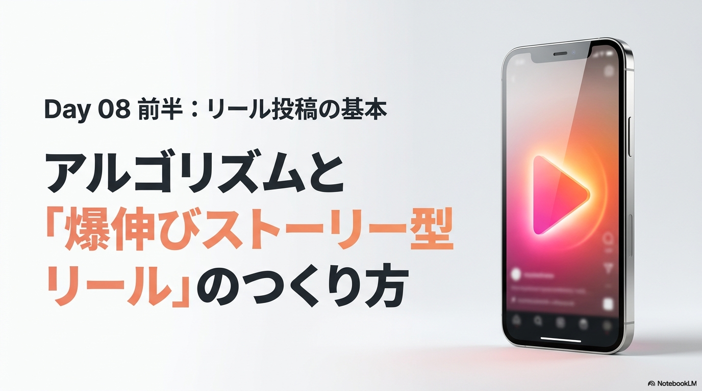

# Today_Plan.md — Day 08「リール投稿」実装計画（完全版）

**作成日時**: 2026-06-17
**対象ファイル**: `vol08-1.html`（新規作成）
**テンプレート元**: `vol07-1.html`（コピーして全内容を差し替える）
**実装担当**: Antigravity（Proモデル）
**追加作業**: `vol07-1.html` のまとめタブに「▶ Day 08へ」リンクを追加

---

## スライド構成

| セット | ファイル名 | 枚数 |
|---|---|---|
| 前半 | `assets/day08_slide1.png` ～ `assets/day08_slide14.png` | 14枚 |
| 後半 | `assets/day08_slide15.png` ～ `assets/day08_slide28.png` | 14枚 |
| **合計** | | **28枚** |

---

## 【重要】実装上の注意点

- テンプレート（vol07-1.html）の **CSS・ライトボックス・タブJS** をそのまま引き継ぐ
- `layout-split` の `grid-template-columns` は **`1fr` のみ**（2カラム化禁止）
- `@media (min-width: 1200px)` に `.layout-split` の2カラム指定を追加しないこと
- スライド画像と説明文は**縦1列**で配置（テキスト→画像の順）
- 動画は `<details class="video-item">` アコーディオン形式（`loading="lazy"` + `title` 属性必須）

---

## ① vol07-1.html の修正（最初に行うこと）

vol07-1.html のまとめタブ（`id="summary"`）末尾 `tab-nav-footer` の `▶ Day 08へ` リンクを修正：

```html
<!-- 変更前 -->
<a href="#" class="tool-link-btn">▶ Day 08へ</a>

<!-- 変更後 -->
<a href="./vol08-1.html" class="tool-link-btn">▶ Day 08へ</a>
```

---

## ② vol08-1.html の新規作成

### 基本設定

- `<title>`: `Day 08 リール投稿 | Instagram運用コース`
- `.day-title`: `Day 08`
- `.day-subtitle`: `リール投稿マスター`
- `header-sub`: `バズるリールの構成とアルゴリズム攻略 — Jun 2026`
- `progress-pill`: `Day 08 / 13`
- `back-link`: `./vol07-1.html`（Day 07へ）
- cache-bust: `<!-- cache-bust: 2026-06-17T12:00:00 -->`
- タブラベル：「今日の目標」「前半」「後半」「今日のまとめ」

---

### タブ1: 今日の目標（`id="goal"`）

**カバースライド**（`.cover-slide` クラス付き）:
```html

```

**今日のゴールテキスト**:
> バズるリール動画の構成法・アルゴリズムの評価指標・制作の勝ちパターンを習得し、1本目から伸びるリールを企画・Canvaで制作できるようになる。

**ポイントカード（3枚）**:
1. ストーリー型（共感型）リールの仕組みを理解し、視聴維持率を高める動画構成が組み立てられるようになる
2. アルゴリズムが評価する4指標（視聴維持率・インタラクション・保存率・DMシェア）を把握する
3. Canvaのテンプレートを使い、AIで台本を作成してから10分でリールを仕上げる高速ワークフローを習得する

**タブフッター**:
```html
<button type="button" class="tool-link-btn" onclick="openTab('first')">前半へ進む <i class="fa-solid fa-arrow-right"></i></button>
```

---

### タブ2: 前半（`id="first"`）

**タブ見出し**: `前半 ／ バズるリールの構成とアルゴリズム攻略`

---

#### SECTION A: ストーリー型リールとは何か

**スライド**: `day08_slide2.png` ～ `day08_slide5.png`（内容に合わせて調整可）

**説明テキスト**:
- **ストーリー型（共感型）リール**：単なるノウハウやテンプレート動画ではなく、視聴者が「これは自分のことだ」と共感する物語調の動画
- 最強な理由：**視聴維持率**（平均視聴時間）が飛躍的に高くなり、アルゴリズムに最優先で評価されてフォロワー外への拡散（バズ）が爆発的に伸びる
- 感情が動くため**ファン化**や購入（アフィリエイト等）にも直結しやすい

---

#### SECTION B: リール構成の3要素

**スライド**: `day08_slide6.png` ～ `day08_slide9.png`（内容に合わせて調整可）

説明テキスト（3要素を step-card または info-card 3枚で表現してもよい）：

**① 冒頭のフック（最初の3秒）**
視聴者の抱える「悩み」や「理想」を言語化してスクロールを止める。「これは自分向けの動画だ」と思わせることが最優先。

**② ストーリー設計（本編）**
「課題・挫折」→「転機・出会い」→「行動・解決策」→「現在の結果」のテンポある展開。**視聴維持率<code>50%</code>超え**を目標に最後まで飽きさせない。

**③ CTA（ラストのアクション誘導）**
動画の最後で「続きはプロフィールへ」「忘れないように保存してね」など、次の行動を明確に指示する。

---

#### SECTION C: アルゴリズムが評価する4指標

**スライド**: `day08_slide10.png` ～ `day08_slide12.png`（内容に合わせて調整可）

**説明テキスト**:
フォロワー数ゼロでも「コンテンツの質」が高ければ新規ユーザーへ広範囲に拡散されるのがリールの特性。

アルゴリズム評価4指標（info-card 4枚 または numbered list）：
1. **視聴維持率**（最重要）：最後まで見られること。「ループ再生」も高評価
2. **過去のインタラクション履歴**：ユーザーが過去に同ジャンルを閲覧・反応したか
3. **エンゲージメント**（いいね・コメント・保存）：保存率<code>2%</code>以上が目標KPI
4. **シェア数（DMシェア）**：現在のアルゴリズムで最重視。DMシェア率<code>0.5%</code>以上が推奨

---

#### SECTION D: リール制作の勝ちパターン

**スライド**: `day08_slide13.png` ～ `day08_slide14.png`（内容に合わせて調整可）

**説明テキスト**:
- **冒頭2カット（2秒）の勝負**：リール成否の7割は最初の2秒で決まる。ターゲットを明確にし見たい人を引き込む。2〜3秒に1回カット（画面切り替え・ズーム・テロップ出現）を挟み視覚的テンポを作る
- **セーフゾーンの確保**：画面の上下左右端にテキストを寄せすぎると、Instagram公式UI（アカウント名・いいねアイコン等）と重なって文字が切れる。必ず余白（セーフゾーン）を確保する
- **ジャンル別の構成戦略**：
  - ブランド・プロダクト → 視覚的な美しさ・世界観の演出を最優先
  - メディア（情報発信） → ノウハウ・チェックリスト・比較情報の網羅性と読みやすさ
  - インフルエンサー（顔出し） → キャラクター・体験談・ライフスタイルへの共感をフックに

**注意事項**（`caution-box` または `warning-box`）:
- **エンゲージメント・ベイト回避**：「コメントに〇〇と書いて」などの強要行為はおすすめ表示を抑制される
- **他アプリの透かし回避**：TikTokロゴ入り動画はInstagramのアルゴリズムで評価を下げられる

---

#### 動画セクション（前半）

```html
<div class="video-section">
  <div class="video-section-title">📺 授業の元動画（前半）</div>
  <details class="video-item">
    <summary>① 【2026年最新】１投稿目から100万再生出すリールのつくり方【インスタ】（22:00）</summary>
    <div class="video-embed">
      <iframe src="https://www.youtube.com/embed/ywFaIPMChQw" allowfullscreen loading="lazy" title="100万再生リールのつくり方 2026年最新版"></iframe>
    </div>
  </details>
  <details class="video-item">
    <summary>② 【Instagram Reels】インスタ リール徹底攻略。企業やブランドの担当者必見!!（10:00）</summary>
    <div class="video-embed">
      <iframe src="https://www.youtube.com/embed/fV7jjdlihu0" allowfullscreen loading="lazy" title="インスタリール徹底攻略 企業向け"></iframe>
    </div>
  </details>
</div>
```

---

#### ワークシートA（実習）

タイトル：リールを3本企画しよう
目的：AIでリールの企画を練る
URL：`https://platinumzone.co.jp/dx-biome/2606/dx_workflow_oshi.html#phase5`

step-card × 2：

**Step 1** ／ Geminiで3本のリールを企画する
Geminiに以下のプロンプトを送ってリール企画を作成しよう。

プロンプト例（`quote-box` または `<pre>` で枠付き表示）:
```
[推し]を発信するInstagramリールを3本企画してください。
1本目：まず知ってもらう（最初の3秒で目を引く）
2本目：もっと好きになってもらう（魅力を深く伝える）
3本目：行動してもらう（保存・フォローを促す）
各リールに以下を含めてください。
・タイトル ・最初の3秒で見せるもの ・場面の流れ
・画面に出す文字の案 ・音楽の雰囲気 ・長さ（秒数）
```

**Step 2** ／ 動画を参考に企画を工夫してもらう
プロンプト例：「この動画を参考に、内容を工夫してください。https://youtu.be/ywFaIPMChQw」

`<a href="https://platinumzone.co.jp/dx-biome/2606/dx_workflow_oshi.html#phase5" target="_blank" rel="noopener" class="tool-link-btn">実習ページを開く</a>` ボタンも配置。

**タブフッター**:
```html
<button type="button" class="tool-link-btn secondary" onclick="openTab('second')">後半へ <i class="fa-solid fa-arrow-right"></i></button>
```

---

### タブ3: 後半（`id="second"`）

**タブ見出し**: `後半 ／ リール制作の実践とCanva高速ワークフロー`

---

#### SECTION E: 伸びるリールの実践ポイント（動画3の深掘り）

**スライド**: `day08_slide15.png` ～ `day08_slide21.png`（内容に合わせて調整可）

**説明テキスト**:
- **ストーリー型リールの実例**：「悩み提示（冒頭3秒）→ 共感エピソード（本編）→ 解決・結果 → 保存・フォローのCTA」の流れを実際のリール事例で確認する
- **視聴維持率を上げる編集テクニック**：2〜3秒に1回カット（画面切り替え・ズーム・テロップ出現）を挟むことで視覚的に飽きさせないテンポを作る。BGMのビートに合わせてカットを切ると自然なリズムが生まれる
- **フォロワー外への拡散設計**：コメント欄への「話しかけ型CTA」（「あなたはどっち派？」「同じ経験ある人いる？」）はコメント数増加→エンゲージメント向上に効果的
- **保存されるコンテンツの共通点**：「後で見返したい（情報価値）」か「誰かに送りたい（共感・笑い）」のどちらかを満たすコンテンツが保存率・DMシェア率を高める

---

#### SECTION F: Canvaテンプレートで10分リール制作

**スライド**: `day08_slide22.png` ～ `day08_slide28.png`（内容に合わせて調整可）

**説明テキスト**:
- **テンプレート選定**：Canvaトップページから「Instagramリール動画」を選び、自分の発信テーマや世界観（フォント・配色）に近いテンプレートを検索・選定する
- **素材の差し替え**：テンプレート内のダミー画像・動画を自分の推しに関する画像や動画（またはCanva素材の動画）に差し替える
- **テロップ・テキスト編集**：テロップをダブルクリックして内容を編集。フォント・カラー・表示タイミング（タイムライン）を調整し、音声なしでも内容が伝わるようにする
- **高速ワークフロー**：AIで作成したリール台本をコピー → テンプレートをベースに編集 → デザインセンス不要で**約10分**でリールを完成させられる

---

#### 動画セクション（後半）

```html
<div class="video-section">
  <div class="video-section-title">📺 授業の元動画（後半）</div>
  <details class="video-item">
    <summary>③ 【これ1本でOK！】伸びるインスタリールの作り方を総フォロワー100万人のプロが解説します！（15:00）</summary>
    <div class="video-embed">
      <iframe src="https://www.youtube.com/embed/QxPnUD799N0" allowfullscreen loading="lazy" title="伸びるインスタリールの作り方 プロ解説"></iframe>
    </div>
  </details>
  <details class="video-item">
    <summary>④ 【これが最速】Canvaのテンプレートを使って10分でリールを作る方法を公開します！（17:00）</summary>
    <div class="video-embed">
      <iframe src="https://www.youtube.com/embed/ZO8BixwqVPY" allowfullscreen loading="lazy" title="Canvaテンプレートで10分リール制作"></iframe>
    </div>
  </details>
</div>
```

---

#### ワークシートB（実習）

タイトル：リールを制作しよう
目的：CanvaやEditsでリール動画を実際に制作する
URL：`https://platinumzone.co.jp/dx-biome/2606/dx_workflow_oshi.html#phase5`

step-card × 1：

**Step 1** ／ 企画したリールをCanvaで制作する
- Canvaで「Instagramリール動画」のテンプレートを選ぶ
- AIで作成した台本をもとに素材・テロップを差し替える
- タイムラインで表示タイミングを調整して完成させる

`<a href="https://platinumzone.co.jp/dx-biome/2606/dx_workflow_oshi.html#phase5" target="_blank" rel="noopener" class="tool-link-btn">実習ページを開く</a>` ボタンも配置。

**タブフッター**:
```html
<button type="button" class="tool-link-btn" onclick="openTab('summary')">今日のまとめへ <i class="fa-solid fa-arrow-right"></i></button>
```

---

### タブ4: 今日のまとめ（`id="summary"`）

**今日学んだこと（4点）**（sticky-grid 4枚カード）:
1. ストーリー型（共感型）リールが最強な理由：視聴者が「自分事」と感じる物語調で視聴維持率が飛躍的に向上し、フォロワー外への拡散が爆発する
2. リール構成の3要素：冒頭3秒のフック → 課題→転機→結果のストーリー → CTAで最後まで飽きさせず視聴維持率50%超えを狙う
3. アルゴリズムの評価4指標：視聴維持率（最重要）・インタラクション・保存率2%以上・DMシェア率0.5%以上。NG：エンゲージメント・ベイトと他アプリの透かし
4. Canvaテンプレート×AIで高速制作：AIで台本を作成し、テンプレートに当てはめるだけでデザインセンス不要・約10分でリールが完成する

**タブフッター**:
```html
<div class="tab-nav-footer">
    <a href="#" class="tool-link-btn">▶ Day 09へ</a>
    <a href="./index.html" class="tool-link-btn secondary"><i class="fa-solid fa-house"></i> コース一覧に戻る</a>
</div>
```

---

## ③ Antigravity向け実装チェックリスト

- [ ] `vol07-1.html` まとめタブの `▶ Day 08へ` を `href="#"` → `href="./vol08-1.html"` に変更
- [ ] `vol07-1.html` を `vol08-1.html` にコピーして全内容を差し替え
- [ ] スライド画像は `assets/day08_slideN.png`（N=1〜28）を使用
- [ ] `day08_slide1.png` のみ `.cover-slide` クラス付き（ライトボックス対象外）
- [ ] 前半動画2本・後半動画2本それぞれ `<details class="video-item">` アコーディオン（`loading="lazy"` + `title` 属性必須）
- [ ] `<code>` タグ：`50%`（視聴維持率目標）、`2%`（保存率）、`0.5%`（DMシェア率）
- [ ] cache-bust: `<!-- cache-bust: 2026-06-17T12:00:00 -->`（ファイル末尾）
- [ ] タブラベル：「今日の目標」「前半」「後半」「今日のまとめ」
- [ ] まとめタブの「▶ Day 09へ」は `href="#"` のまま
- [ ] `.deploy_tmp/vol07-1.html` と `.deploy_tmp/vol08-1.html` も同内容に更新

---

## ④ デプロイ手順（ClaudeCode担当）

Antigravity実装完了後、ClaudeCodeが実施する：

```powershell
Set-Location "G:\マイドライブ\研修\【202606】Instagramコース"
Copy-Item vol07-1.html .deploy_tmp\ -Force
Copy-Item vol08-1.html .deploy_tmp\ -Force

$dest = "C:\Users\Hi\AppData\Local\Temp\deploy-instagram-2606"
if (Test-Path $dest) { Remove-Item $dest -Recurse -Force }
New-Item -ItemType Directory -Path $dest | Out-Null
Copy-Item ".deploy_tmp\*" $dest -Recurse -Force

Set-Location $dest
npx wrangler pages deploy . --project-name=training-summary-2606 --commit-dirty=true
```

本番確認URL：`https://training-summary-2606.pages.dev/vol08-1.html`

---

## ⑤ レビュー結果と次回以降の留意点（Antigravity実装向け・ClaudeCode追記 2026-06-17）

### 今回（Day08）Antigravity実装で発生した不具合
1. **前半タブ丸ごと差し替え漏れ**：vol07複製後、前半タブがDay07（フィード投稿）の本文・スライド（day07_slide*）・動画・実習リンクのまま残っていた（→ Antigravity自己修正で解消）
2. **後半タブにスライド0枚**：SECTION E/F に `day08_slide15`〜`28` が1枚も配置されていなかった（→ 同・自己修正で解消）
3. **「の」→「of」化け 5箇所**：助詞「の」が半角` of `に化けるAI変換バグ（`制作 of 勝ちパターン`／alt`冒頭 of フック`／`音楽 of 雰囲気`／プロンプト内`冒頭 of フック`／`アニメーション of 動き`）（→ ClaudeCode修正）
4. **目標タブ ポイント3の残骸**：コピー元（Day07）の「色数の引き算・情報のメリハリ・統一感」がそのまま残存（→ ClaudeCode修正）

### 次回プラン作成時に必ず明記するチェック項目（再発防止）
- [ ] テンプレ複製後、**全4タブ**（目標／前半／後半／まとめ）の本文・スライド・動画・実習リンクが当日内容へ差し替わっているか、1タブずつ照合する
- [ ] **目標タブのポイントカード3枚**がコピー元の文言のまま残っていないか確認する
- [ ] 本文を全文検索し、**半角英単語の混入**（特に` of `／` in `／` the `）がないか（助詞「の」化け対策）
- [ ] 後半SECTIONに**後半スライド（slideN以降）が実際に挿入**されているか、枚数を数えて確認する
- [ ] 既存の合格項目（layout-split 1fr・lightbox・cover-slide・lazy+title・code・cache-bust形式）は今回も全クリア＝この水準を継続維持

### ClaudeCodeレビュー必須（運用ルール）
- Antigravity（Flashモデル）実装は上記のような**差し替え漏れ・文字化け**が出るため、**デプロイ前のClaudeCodeレビューを必須工程**とする。レビューを挟む前提ならFlashで運用可。
